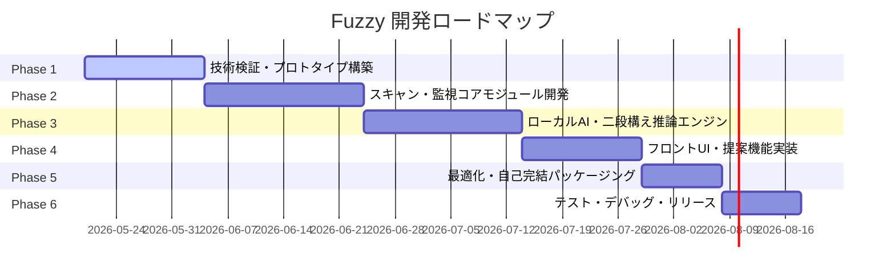

# Fuzzy 開発全体工程・ロードマップ策定書

本ドキュメントは、ローカル完結型のファイル大掃除支援アプリ「Fuzzy」の要件定義から技術検証、実装、パッケージング、そしてリリースに至る全体の開発フェーズとマイルストーンを定義したものです。

---

## 全体開発フェーズ一覧

本プロジェクトは、C#とRustのハイブリッドアーキテクチャおよびインプロセスなローカルAI推論という高度な技術を統合するため、以下の6つのフェーズに分けて順次進めていきます。

---

## 各フェーズの詳細とマイルストーン

### Phase 1: 要件定義・技術検証（Feasibility Study & Prototyping）
- **目的**: 根幹技術（C#-Rust連携、ローカルAIインプロセス推論）の実現可能性の検証と、基本設計の確立。
- **主要タスク**:
  - **アーキテクチャ・スキーマ設計**: SQLiteのデータモデル設計およびフォルダー構造の定義。
  - **UIプロトタイピング**: C# (WinUI 3) によるメインUIの基本画面設計・モックアップ作成。
  - **C#-Rust連携（P/Invoke）検証**: Rustでハッシュ計算を行う簡易DLLを作成し、C#からメモリ共有（P/Invoke）で呼び出して高速動作することを確認する。
  - **ローカルAI（LLaMA-Sharp）動作検証**: C#からLLaMA-Sharpを呼び出し、軽量LLMモデル（Llama 3.2 1B等）およびEmbeddingモデルが正常に動作するかの検証。
- **マイルストーン 1 (M1: PoC完了)**: 
  - C#からRustライブラリの呼び出しおよび、C#単体でのローカルAI推論がスタックせずに動作すること。

### Phase 2: スキャンおよび動的監視コア開発（Scan & Monitor Core）
- **目的**: ファイルシステムの高速走査（Rust）とOSの変更監視（C#）を統合し、SQLiteデータベースへインデックスを自動反映する仕組みを構築する。
- **主要タスク**:
  - **監視システムの実装**: C#の `FileSystemWatcher` を用いたバックグラウンドのファイル追加・変更・削除の動的監視サービスの実装。
  - **高速スキャンエンジンの実装**: Rustによる並列ファイル走査処理とハッシュ計算処理の実装。
  - **差分同期アルゴリズムの実装**: ファイルの変更検知をキューイングし、SQLiteのDBをリアルタイムで差分更新する処理の実装。
- **マイルストーン 2 (M2: インデックス同期完了)**:
  - バックグラウンドでフォルダの変更が検知され、数秒以内にSQLiteのインデックスDBへ差分反映されること。

### Phase 3: ローカルAI/推論フィルタリングフロー開発（AI Inference Flow）
- **目的**: 動作負荷を抑えるための「二段構えの動的解析フロー」の実装と、AIモデル配信機能の構築。
- **主要タスク**:
  - **第1段階：高速Embeddingフィルタリングの実装**:
    - Embeddingモデル（数MB）を用いたファイルテキストのベクトル化。
    - コサイン類似度を用いた「類似候補ペア」の高速計算ロジック。
  - **第2段階：詳細LLM判定の実装**:
    - 類似候補に挙がったファイルに対し、LLaMA-Sharpを駆動して詳細比較を実施。
    - 「重複・不要と判断した理由」を出力させるための頑健なプロンプトの設計。
  - **モデルマネージャーの実装**:
    - アプリの初回起動時に、指定したGGUF形式のAIモデルをサーバーから安全にダウンロードし、ローカルに自動配置する処理。
- **マイルストーン 3 (M3: AIフィルタリングフロー完成)**:
  - テキストが類似したファイル（例：「報告書_最終版.txt」と「報告書_コピー.txt」）が、クラウドなしで自動検出され、類似スコアと削除推奨の理由が提示されること。

### Phase 4: UI/UXおよびユーザー提案機能開発（Frontend & UX）
- **目的**: AIの検出結果をユーザーが確認し、直感的かつ安全に整理（削除・移動）を行える画面と対話フローを実装する。
- **主要タスク**:
  - **提案・レビュー画面の実装**: 
    - WinUI 3による美しいカード型の提案UI（スコアの高い順に表示、比較プレビュー機能）。
    - ユーザーに「なぜこのファイルが不要と提案されているのか」を視覚的に伝える説明UIの作成。
  - **安全な処理アクションの実装**:
    - ユーザーが選択したファイルの「安全削除（Windowsごみ箱への移動）」または「退避用フォルダへの一括移動」の実装。
  - **設定画面の実装**:
    - スキャン対象フォルダの設定、除外パターン（特定の拡張子やシステムディレクトリの除外）、類似度閾値の調整。
- **マイルストーン 4 (M4: UI/UX結合完了)**:
  - ユーザーがデスクトップ画面のUI操作だけで、安全に類似ファイルを一覧確認・個別選択削除できる一連のユースケースが動作すること。

### Phase 5: 配布最適化とパッケージング（Optimization & Packaging）
- **目的**: ユーザーが追加のツール（ランタイム等）をインストールせずに動く、完全スタンドアロンなパッケージのビルド。
- **主要タスク**:
  - **自己完結型パブリッシュ**: C# (.NET 8 / WinUI 3) の `Self-Contained` ビルド設定の実施。
  - **Rust静的リンクの検証**: SQLiteの静的リンク確認および不要オブジェクトのデバッグトリム。
  - **インストーラーの作成**: MSIXパッケージまたは軽量な Inno Setup によるWindows用インストーラーの構築。
- **マイルストーン 5 (M5: パッケージ製品化完了)**:
  - インストーラーを実行するだけで、他PCでも動作可能なスタンドアロン配布パッケージ（MSIX等）が生成できること。

### Phase 6: テスト・デバッグ・最終リリース（Testing & Release）
- **目的**: リソース負荷（メモリ・CPU）、IOの安全性、判定ロジックのロバストネスを多角的に検証し、安定版をリリースする。
- **主要タスク**:
  - **ストレステスト**: 数十万ファイルが存在する大容量ストレージ環境でのメモリリークやCPU占有率の監視、クラッシュ対策。
  - **互換性テスト**: GPU非搭載PCや古いWindows 10/11環境での動作チェック。
  - **リリース作業**: GitHub Releasesを通じた初版リリースの実施。
- **マイルストーン 6 (M6: プロダクションリリース)**:
  - リリース品質基準（重度バグ0件、スキャン安全動作確認）をクリアし、Fuzzyアプリの公開を行うこと。
