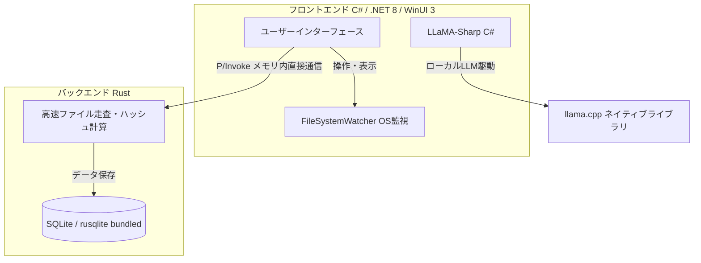

# Fuzzy 開発方法・技術スタック調査報告書

本ドキュメントは、企画提案書（`s2410210 (1).pdf`）に基づき、デスクトップアプリケーション「Fuzzy」の技術スタック、アーキテクチャ、および実装手法について調査・整理したものです。

---

## 1. アプリケーションの概要とコアコンセプト

Fuzzyは、PC内に無秩序に蓄積されたファイルを動的にスキャン・監視し、ローカルAIを活用して「重複ファイル」「内容が類似したファイル」「長期間未使用の不要ファイル」を検出・整理提案する、Windowsネイティブのデスクトップアプリケーション（大掃除支援ツール）です。

### 核心となる3つのアピールポイント
1. **安全な設計と動的監視の両立**
   - バックグラウンドでの自動削除や自動移動は一切行いません。
   - OSレベルでファイルシステムの変更（追加・更新・削除）をバックグラウンド監視し、差分インデックスのみを動的更新します。これにより、ユーザーがスキャンを要求した際の待ち時間を最小限に抑えつつ、最終的な実行判断をユーザーに委ねる安全設計を実現します。
2. **ハイブリッド検出による高度な提案**
   - 単なるファイル名やハッシュ値の一致（完全重複）の検出に留まりません。
   - ローカルAIによるテキスト解析を活用し、「ファイル名は異なるが内容が極めて類似している古いレポート」といった**意味的な類似性**を検出します。
3. **プライバシーを保護するローカル完結型処理**
   - 個人情報や機密情報を含むファイルを扱うため、外部クラウドへのデータ送信は一切行いません。
   - すべてのAI処理とデータベース処理をデバイス内で完結させる、安全なオフライン・アーキテクチャを採用します。

---

## 2. システム構成と技術スタック

追加の環境構築（PythonやDocker、Ollama等のインストール）を一切不要とする「完全スタンドアロンアプリ」として構築するため、以下の**インプロセス実行型技術スタック**を採用します。

### 各コンポーネントの役割と詳細

| レイヤー | 技術・ライブラリ | 役割と詳細 | 単一アプリ化（スタンドアロン）の手法 |
| :--- | :--- | :--- | :--- |
| **フロントエンド** | C# (.NET 8 / WinUI 3) | ・メインUIの提供 ・`FileSystemWatcher` クラスを用いたOSレベルのファイルシステム変更監視 | **自己完結型（Self-Contained）デプロイ**としてビルドし、.NETランタイムをバイナリに同梱する。 |
| **バックエンド** | Rust | ・高速なファイル走査（スキャン） ・ファイルのハッシュ値計算 | C#と **P/Invoke**（Platform Invoke）を介してメモリ内でデータを直接やり取りし、高速通信を実現。 |
| **AI推論エンジン** | LLaMA-Sharp (C#) | ・ローカルLLM（Llama 3.2等）の駆動 ・テキストのベクトル化（Embedding） | Pythonや外部ツール（Ollama等）に依存せず、C#から `llama.cpp` のネイティブライブラリを直接制御し、プロセス内でAI推論を完結。 |
| **データベース** | SQLite (`rusqlite`) | ・スキャン結果やインデックス情報の保存 | 外部サーバー不要のファイル型DBを採用。Rust側で `rusqlite` の **`bundled` フィーチャー**を使用し、バイナリ内にSQLiteを静的リンク。 |

---

## 3. 実装上の主要課題と解決アプローチ

ローカル環境でのリソース制限や配布サイズ、起動速度といったデスクトップアプリ特有の課題に対して、以下の画期的なアプローチをとります。

### ① 配布サイズと起動速度の最適化（AIモデルの配信）
- **課題**: 数GBに及ぶLLMモデル（GGUF形式）を同梱すると、アプリの初期配布サイズが肥大化する。
- **対策**: AIモデルは**初回起動時に自動ダウンロード**させるか、あるいは最小限の軽量モデル（Llama 3.2 1B/3Bなどの量子化モデル）をアプリのリソースとして同梱する設計を選択可能にします。

### ② 二段構えの動的解析フロー（処理負荷の軽減）
- **課題**: すべてのテキストやファイルをLLM（Llama 3.2）に入力すると、CPU/GPU負荷が非常に高くなり、類似性計算に膨大な時間がかかる。
- **対策**:
  1. **第1段階（高速フィルタリング）**: まず、数MB程度の軽量な「Embeddingモデル」を使用し、テキストを高速にベクトル数値化。コサイン類似度を用いて、類似している疑いのあるファイルを高速に抽出する。
  2. **第2段階（詳細判定）**: 類似の疑いがあると判定されたファイルペアのみをローカルLLMに入力し、重複の最終判定および削除・整理すべき具体的な理由付け（セマンティックな判断）を行わせる。
  - この二段階構成により、システム負荷を現実的な範囲に抑え、軽快な動作を実現します。
