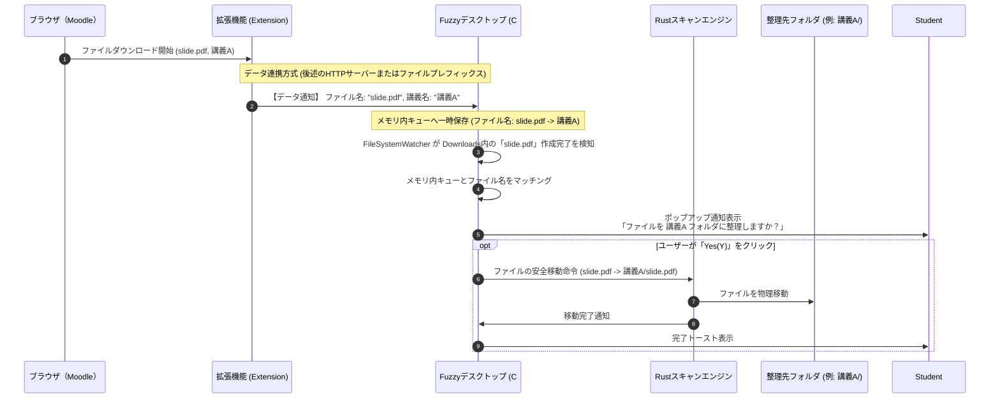

# デスクトップアプリとブラウザ（Moodle）間のデータ連携設計

本ドキュメントは、Moodleから抽出した「講義名（コース名）」と「ダウンロードファイル」をデスクトップアプリへ引き渡し、リアルタイムにフォルダ分類を行うための連携メカニズムについて設計・検証したものです。

---

## 1. 連携の全体シーケンスと役割分担

整理アプリ「Fuzzy」は、フロントエンドがC# (.NET 8 / WinUI 3) であり、バックエンドがRustです。ブラウザ側で検知した「ダウンロードイベントと講義名」をデスクトップアプリが安全かつリアルタイムに受信し、ファイル移動へと繋げるフローは以下の通りです。



---

## 2. 連携方式の3つのアプローチ比較

ブラウザ（拡張機能）からデスクトップアプリへデータを送るための3つの設計アプローチを検証・比較しました。

### 方式A：デスクトップアプリ内「ローカルHTTPサーバー」起動方式（推奨）
- **概要**: 
  C#側で軽量なWebサーバー（`HttpListener` または Kestrel）を `localhost:4639` 等で起動しておき、拡張機能から `fetch(POST)` でJSONデータを送信します。
- **データペイロード例**:
  ```json
  {
    "event": "DOWNLOAD_COMPLETED",
    "originalName": "s2410210_report.pdf",
    "courseName": "アルゴリズムとデータ構造"
  }
  ```
- **メリット**:
  - 実装が最も容易かつ標準的。
  - 拡張機能（JavaScript）側からの接続制限が緩い（localhost宛てのfetchは特別な権限なしで可能）。
- **デメリット**:
  - ポート衝突の可能性（他のアプリが同じポートを使用している場合）を考慮し、空きポート自動検出と拡張機能へのポート通知機能が必要。

### 方式B：Native Messaging 方式
- **概要**:
  Chromeが提供する公式の「Native Messaging API」を使用します。インストール時にWindowsレジストリへ専用の manifest ファイルを登録し、ブラウザとアプリを標準入出力（stdin/stdout）経由のJSONメッセージで常時双方向通信させます。
- **メリット**:
  - 最もセキュアであり、ファイアウォールなどの影響を一切受けない。
  - ポートの競合が発生しない。
- **デメリット**:
  - インストーラーによるレジストリ登録が必要でセットアップ難易度が高い。
  - プロセス間通信（IPC）がブラウザ経由になるためデバッグが難解。

### 方式C：ファイル名プレフィックス方式（ゼロIPC方式）
- **概要**:
  IPCや通信ポートを一切使わない画期的なアイデアです。
  1. 拡張機能の `chrome.downloads` APIで保存時にファイル名を一時的に書き換えます（例: `slide.pdf` -> `__fuzzy__[講義A]__slide.pdf`）。
  2. デスクトップアプリの `FileSystemWatcher` が `__fuzzy__[講義名]__` で始まるファイルを検知。
  3. デスクトップアプリが講義名をファイル名から抽出し、ポップアップを表示。
  4. ユーザーが承認したら、プレフィックスを取り除いた綺麗なファイル名（`slide.pdf`）に戻した上で、該当フォルダ（`講義A/slide.pdf`）へ移動します。
- **メリット**:
  - 通信ポートもレジストリも一切不要。ファイルシステム単体で完結し、誤動作が最も少ない。
  - バグの混入経路が極限まで減る。
- **デメリット**:
  - ブラウザのダウンロード履歴に、一瞬プレフィックス付きの奇妙なファイル名が表示される。

---

## 3. 推奨設計：方式A（ローカルHTTPサーバー）と方式Cの併用・フォールバック

開発の堅牢性とユーザー体験を最大化するため、以下の**ハイブリッド連携メカニズム**を提案・設計します。

1. **メイン機能（方式A：ローカルHTTPサーバー方式）**:
   - C#フロントエンド側でバックグラウンドタスクとして `HttpListener` をポート `4639`（デフォルト）でホストします。
   - 拡張機能はダウンロード開始（`onCreated`）および完了（`onChanged`）時に情報を通知します。
   - アプリ側は通知を受け取ると「待機状態」になり、`FileSystemWatcher` でファイルが完全に書き込まれた瞬間にポップアップを立ち上げます。

2. **フォールバック（方式C：ファイル名プレフィックス方式）**:
   - 何らかの理由（セキュリティソフトのブロック、ポートの競合等）でローカルHTTP通信が遮断された場合、拡張機能は自動で「ファイル名プレフィックス付与方式」に切り替えてダウンロードを実行します。
   - アプリ側は、プレフィックス検知によって通信を経由せずとも同様の整理フローを立ち上げることができます。

この二段構えのフォールバック構成により、多様なWindowsセキュリティ設定環境下にある大学生のノートPCにおいて、**「絶対に動く」**自動整理ソリューションが実現します。
