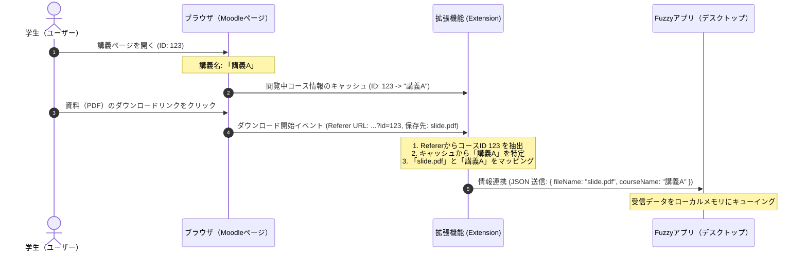

# Moodleからの講義情報・ファイル名抽出手法の技術検証

本ドキュメントは、学生向け資料整理アプリ「Fuzzy」における、ローカルAI/LLMを使用しないブラウザ（Moodle）連携型自動分類技術について、Moodleの構造分析とブラウザ側でのデータ抽出手法を検証・整理したものです。

---

## 1. MoodleのDOM構造分析と情報抽出

Moodle（一般的なLMS：学習管理システム）は、Web標準技術とセマンティックなHTML構造で構成されているため、ブラウザ側（Content Script）からDOM（Document Object Model）を解析することで、極めて高精度に「講義情報（コース名）」を抽出できます。

### ① 講義名（コース名）の抽出手法
Moodleの各講義のトップページ（URLが `course/view.php?id=XXX` 形式）は、標準的なテーマにおいて以下のような特徴的なHTMLクラスを持っており、セレクターによって瞬時に講義名を取得できます。

*   **HTML構造の例（一般的なMoodleテーマ）**:
    ```html
    <div id="page-header" class="row">
        <div class="col-12">
            <div class="page-header-headings">
                <h1 class="h2">アルゴリズムとデータ構造（木曜2限）</h1>
            </div>
        </div>
    </div>
    ```
*   **CSSセレクターによる抽出コード**:
    ```javascript
    // コース名ヘッダーの取得
    const courseHeader = document.querySelector('.page-header-headings h1, #page-header h1');
    let courseName = courseHeader ? courseHeader.innerText.trim() : '';

    // 正規表現によるクレンジング（年度やクォーターなどの余分な情報のトリミング）
    courseName = courseName.replace(/（[^）]+）|\([^)]+\)|\[[^\]]+\]/g, '').trim();
    // 例: 「アルゴリズムとデータ構造（木曜2限）」 -> 「アルゴリズムとデータ構造」
    ```

### ② 配布資料（ファイル）のダウンロード検知手法
Moodle上の講義資料は、通常 `mod/resource/view.php?id=YYY` や `pluginfile.php/...` といったダウンロードリンク形式になっています。
学生がこれらの資料をダウンロードする動きを検知・捕捉するには、以下の2つのアプローチがあります。

| 検知手法 | メカニズム | メリット | デメリット・課題 |
| :--- | :--- | :--- | :--- |
| **A. DOMイベント監視 (Content Script)** | Moodleページ内のダウンロードリンククリック (`click` イベント) を監視・傍受する。 | ・通常のWebスクリプトだけで実装可能。<br>・ダウンロードボタンのクリックと同時に即座に講義名と紐付け可能。 | ・ブラウザの「名前を付けて保存」でファイル名を変更された場合、ローカルに保存される実際のファイル名と一致しなくなる。 |
| **B. downloads API監視 (Chrome Extension)** | `chrome.downloads` APIを利用し、ブラウザ全体のダウンロード開始・完了イベントを監視する。 | ・実際に保存された**「ローカルの絶対パス・ファイル名」を100%確実に取得可能**。<br>・名前変更や自動採番による重複回避ファイル名にも対応。 | ・拡張機能（Extension）の開発とブラウザ権限の要求が必要。 |

---

## 2. 推奨される抽出設計：ハイブリッド連携方式

ブラウザ拡張機能（Chrome Extension / Edge Extension）の特権的な機能とMoodleのDOM解析を組み合わせた、**「ローカルキャッシュ＆Referer紐付け方式」**を提案します。この方式により、高負荷なLLMを一切使わず、ローカルプライバシーを完全に守ったまま、高精度な分類が可能になります。



### 抽出プロセス処理ロジックの概要（ブラウザ側）

1.  **コース情報の収集とローカルストレージへのキャッシュ**:
    ユーザーがMoodleの講義ページを閲覧したタイミングで、Content Scriptが作動し、現在の「コースID（URLの `id` パラメータ）」と「クレンジング後の講義名」を取得し、拡張機能のローカルストレージ（`chrome.storage.local`）にキャッシュします。
    ```javascript
    // 講義ページでのキャッシュ保存処理
    const urlParams = new URLSearchParams(window.location.search);
    const courseId = urlParams.get('id');
    if (courseId && document.querySelector('.page-header-headings h1')) {
        const rawCourseName = document.querySelector('.page-header-headings h1').innerText;
        const cleanCourseName = rawCourseName.replace(/（[^）]+）|\[[^\]]+\]/g, '').trim();
        chrome.storage.local.set({ [`course_${courseId}`]: cleanCourseName });
    }
    ```

2.  **ダウンロードイベントの検知と講義名の逆引き**:
    拡張機能のBackground Script（Service Worker）でダウンロード監視を回し、ダウンロードが生成されたタイミングで、`referrer`（元のダウンロード元ページ）のURLから講義IDを抽出してキャッシュから講義名を取得します。
    ```javascript
    chrome.downloads.onCreated.addListener(async (downloadItem) => {
        const referrer = downloadItem.referrer;
        if (!referrer) return;

        // RefererのURLからMoodleのコースIDを正規表現で抽出
        const match = referrer.match(/course\/view\.php\?id=(\d+)/);
        if (match) {
            const courseId = match[1];
            // キャッシュから講義名を取得
            const res = await chrome.storage.local.get(`course_${courseId}`);
            const courseName = res[`course_${courseId}`];
            
            if (courseName) {
                // ローカルに保存される実際のファイル名（一時ファイル名）
                const fileName = downloadItem.filename;
                // デスクトップアプリへ送信する情報を作成
                sendToFuzzyApp({
                    event: "DOWNLOAD_STARTED",
                    downloadId: downloadItem.id,
                    filename: fileName,
                    courseName: courseName
                });
            }
        }
    });
    ```

---

## 3. 実装上の検証結果と安全性

### ① 技術的なメリット
- **LLMリソースの不要化**:
  テキストのベクトル化やプロンプト推論を一切行う必要がないため、CPU/GPUリソースの消費量はほぼ「ゼロ」であり、ノートPCのバッテリー持ちへの影響が皆無です。
- **データプライバシーの完全保証**:
  大学や学生の機密講義データが学外やクラウドに送信される余地が最初から存在しないため、大学のセキュリティポリシーに完全に合致した安全な設計となります。
- **誤分類率が「ほぼ0%」**:
  LLMのハルシネーション（誤った分類）やEmbeddingの類似度しきい値の誤判定とは異なり、「どの講義ページからダウンロードされたか」というシステム的な事実情報に基づいて紐付けを行うため、フォルダ誤分類がほぼ発生しません。

### ② 制限事項と考慮点
- **Moodle以外のダウンロード**:
  MoodleのWebページから直接ダウンロードしたもの以外のファイル（例: Teamsで受け取ったファイル、ローカルで作成したファイル）はこの方法では分類できません。そのため、以前策定した「二段構えローカルAI分析エンジン（docs/fuzzy_tech_stack.md）」を補助エンジンとして残し、**「Moodleから取得したものはルールベースで超高速に自動分類（誤分類ゼロ）」**、**「それ以外のファイルはローカルAIで類似性スキャン」**というハイブリッド戦略をとることで、隙のない完璧なソリューションとなります。
